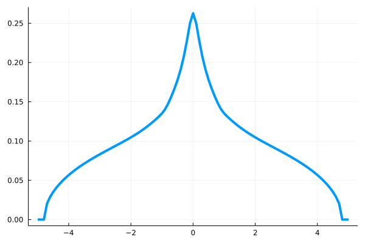
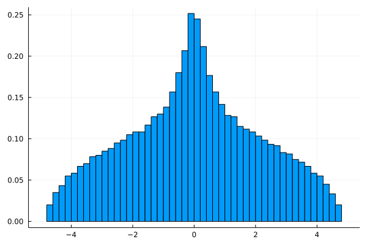
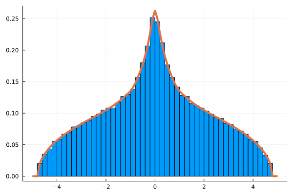
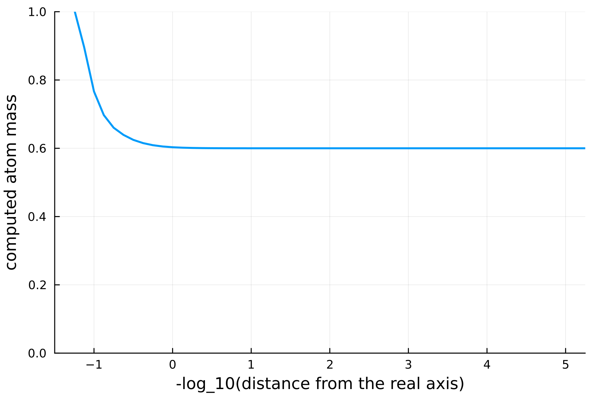
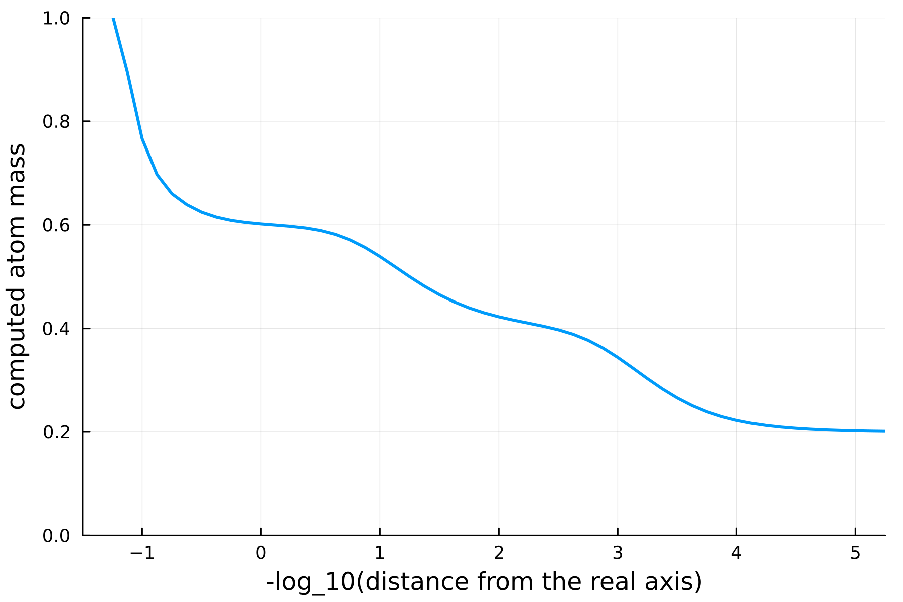

# NCDist.jl

## About

NCDist.jl is a Julia package to compute distributions as well as Brown measures of (self-adjoint) rational expressions and matrix-valued elements given the distributions of the variables.
It provides implementations of the [subordination algorithm](https://arxiv.org/abs/1303.3196) and an [operator-valued semicircular algorithm](https://arxiv.org/abs/math/0703510) for semicircle distributions.

NCDist.jl was created by [Johannes Hoffmann](https://www.uni-saarland.de/lehrstuhl/speicher/team/johannes-hoffmann.html) and [Tobias Mai](https://www.math.uni-sb.de/ag/speicher/maiE.html).
It is based on [Tobias' PhD thesis](https://publikationen.sulb.uni-saarland.de/bitstream/20.500.11880/26760/1/Pflichtexemplar.pdf).

## Installation

In the package manager (accessible in the REPL via `]`):

```julia
(@v1.8) pkg> add https://github.com/johannes-hoffmann/NCDist.jl
```

Now leave the package manager (via backspace) and load the package:

```julia
julia> using NCDist
```

## Usage

After loading the package, you can find detailed usage instructions including information on the parameters for all of the functions via the help functionality of the REPL by typing a question mark `?` followed by the name of the function.

### Provided functions

To compute distributions for arbitrary variable distributions:

* `distribution_rational`
* `distribution_operator`

To compute distributions for semi-circle variable distributions:

* `distribution_rational_semicircle`
* `distribution_operator_semicircle`

To compute Brown measures for arbitrary variable distributions at a collection of points:

* `brown_rational`
* `brown_operator`

To compute Brown measures for arbitrary variable distributions at points on a grid:

* `brown_rational_grid`
* `brown_operator_grid`

To compute Brown measures for semi-circle variable distributions at a collection of points:

* `brown_rational_semicircle`
* `brown_operator_semicircle`

To compute Brown measures for semi-circle variable distributions at points on a grid:

* `brown_rational_grid_semicircle`
* `brown_operator_grid_semicircle`

Also consider the following two simple rules:
* If the name of the function includes `operator`, then it applies to matrix-valued elements, otherwise it applies to rational expressions.
* If the name of the function includes `semicircle`, then it will consider all variables to have semicircle distributions and compute the results via the operator-valued semicircular algorithm. Otherwise, the variable distributions must be specified (see below) and the subordination algorithm will be used.

### Inputs

Most of the functions in this package use inputs of the following types:

#### Rational expressions

You need to provide the rational expression or matrix-valued element in the form of a linearization `L`, which in this package is an `Array{Complex{Float64}, 3}`, where `L[:, :, k]` is the matrix corresponding to the variable with index `k-1` (`L[:, :, 1]` corresponds to the constant part).

#### Variable distributions

Furthermore, the distributions of the variables `var_dists` are given as a `Vector{<:Function}`, whose entries are their Cauchy transforms (on the upper half-plane) . For convenience, several common cases are provided.

* `semicircle`
* `poisson`
* `bernoulli`
* `symmetric_bernoulli`
* `cauchy`
* `arcsine`

## Examples

To allow for easy copy and paste, the prefix `julia>` of the REPL will be omitted in the code examples. All examples assume that `NCDist` is already installed and loaded.

### Compare a histogram of the eigenvalues with the computed distribution

For this example we need the following additional packages: `Plots`, `Kronecker`, `RandomMatrices`, `LinearAlgebra`.
They are part of the official julia repository and can be installed via the package manager (e.g. `add Plots`).
Then, we load them:

```julia
using Plots
using Kronecker
using RandomMatrices
using LinearAlgebra
```

Now, consider the following (self-adjoint) matrix over the complex numbers with noncommuting variables $x_1$, $x_2$, and $x_3$:

$$
A
=\mathrm{i}\cdot\begin{bmatrix}
    0&2x_1-x_3&x_2\\
    -2x_1+x_3&0&x_3\\
    -x_2&-x_3&0
\end{bmatrix}.
$$

A linearization of $A$ can be created as follows (`im` is the julia-Version of the imaginary unit):

```julia
L = zeros(3, 3, 4)
L[1, 2, 2] =  2
L[2, 1, 2] = -2
L[1, 3, 3] =  1
L[3, 1, 3] = -1
L[1, 2, 4] = -1
L[2, 1, 4] =  1
L[2, 3, 4] =  1
L[3, 2, 4] = -1
L = L * im
```

Again, `L[:, :, 3]` corresponds to the coefficients of the second variable $x_2$.

Now, we need to choose some parameters:

```julia
x_range = -5:0.1:5
sample_mat_size = 1000
```

Here, we want to compute the distribution on all points from $-5$ to $5$ with step size $0.1$.
Additionally, we specifiy that the random matrices we want to compute the histogram of the eigenvalues from should be of size $1000\times1000$.

Now, we can compute the distribution:

```julia
dist = distribution_operator_semicircle(L, x_range)
```

This is just an array of real numbers, so we can plot them against `x_range` to get the distribution:

```julia
P_dist = plot(x_range, dist; legend = false, linewidth = 4)
```
Note that all parameters after `;` are optional and in this example are only used to improve the visuals of the plots.
For example, setting the parameter `linewidth` to $4$ gives us a thicker line, so later it will stand out better against the histogram.

(If you do this in a specialized IDE, an image of the graph might pop up. If not, you can use `safefig(P_dist, "filename")` to save the image as `filename.png` to your current working directory, which can be determined by `pwd()`.)



To get a histogram, use the following:

```julia
d = GaussianHermite{2}
full_size = sample_mat_size * size(L, 1)
mat = kronecker(L[:,:,1], I(sample_mat_size))
for var_index in 2:size(L, 3)
    M = rand(d(), sample_mat_size)
    mat += kronecker(L[:, :, var_index], M)
end
P_hist = histogram(
    real(eigen(mat).values);
    bins = round(Integer, 2 * sqrt(sample_mat_size)),
    legend = false,
    normed = true
)
```

Here, `d` is a Gaussian unitary ensemble to draw random matrices from. The parameter `bins` represents the number of bars that should appear in the histogram.
The value chosen here works well for this example, but feel free to experiment with other values.
Again, you can save the image via `safefig(P_hist, "filename")`.



Lastly, to compare the two, we plot both the distribution and the histogram in one plot:

```julia
P_both = plot(P_hist, x_range, dist; linewidth = 4)
```



To further tweak the appearances of the graphs, check out the [`Plots` manual](https://docs.juliaplots.org/latest/).

The following collects all the code used above to get the three images:

```julia
using NCDist
using Plots
using Kronecker
using RandomMatrices
using LinearAlgebra

L = zeros(3, 3, 4)
L[1, 2, 2] =  2
L[2, 1, 2] = -2
L[1, 3, 3] =  1
L[3, 1, 3] = -1
L[1, 2, 4] = -1
L[2, 1, 4] =  1
L[2, 3, 4] =  1
L[3, 2, 4] = -1
L = L * im

x_range = -5:0.1:5
sample_mat_size = 1000

dist = distribution_operator_semicircle(L, x_range)
P_dist = plot(x_range, dist; legend = false, linewidth = 4)
savefig(P_dist, "P_dist")

d = GaussianHermite{2}
full_size = sample_mat_size * size(L, 1)
mat = kronecker(L[:,:,1], I(sample_mat_size))
for var_index in 2:size(L, 3)
    M = rand(d(), sample_mat_size)
    mat += kronecker(L[:, :, var_index], M)
end
P_hist = histogram(
    real(eigen(mat).values);
    bins = round(Integer, 2 * sqrt(sample_mat_size)),
    legend = false,
    normed = true
)
savefig(P_hist, "P_hist")

P_both = plot(P_hist, x_range, dist; linewidth = 4)
savefig(P_both, "P_both")
```

### Inner rank of a matrix and impact of the distance to the real axis

Consider the following matrix over the free field generated by two non-commuting variables $x_1$ and $x_2$:

$$
L
=\begin{bmatrix}
    0&0&0&0&1\\
    0&0&0&0&-4\\
    0&0&0&0&-10\\
    0&0&0&0&-2\\
    1&-4&-10&-2&-1
\end{bmatrix}\otimes x_1+\begin{bmatrix}
    0&0&0&0&7\\
    0&0&0&0&-4\\
    0&0&0&0&7\\
    0&0&0&0&-6\\
    7&-4&7&-6&-7
\end{bmatrix}\otimes x_2.
$$

Its inner rank is given by $n(1-a(L))$, where $n=5$ is its dimension and $a(L)$ is the mass of the atom at zero.
With NCDist.jl we can compute upper bounds for the mass of the atom, resulting in lower bounds for the inner rank.
The quality of the computed bound depends on how close to the real axis the computations are carried out.
This can be controlled via the optional parameter `y_shift`.
To illustrate the dependence, consider the following function:

```julia
function shift_comparison(
    L::Array{Complex{Float64}, 3},
    shifts
)
    Y = zeros(Float64, length(shifts))
    for shift_index in 1:length(shifts)
        y_shift = 10.0^(-shifts[shift_index])
        result = distribution_operator_semicircle(L, [0.0]; y_shift)[1]
        result *= y_shift * pi
        Y[shift_index] = result
    end
    P = plot(
        shifts,
        Y;
        legend = false,
        linewidth = 2,
        xlabel = "-log_10(distance from the real axis)",
        ylabel = "computed atom mass",
        xlims = (minimum(shifts), maximum(shifts)),
        ylims = (0,1),
        dpi = 300
    )
    return P
end
```

Given the matrix `L` and a collection of `shifts`, compute for each such `y_shift` the appropriately normalized mass of `L` at zero at a distance of `y_shift` to the real axis, then plot it nicely.
Now we can apply this to our example:

```julia
    L = zeros(Complex{Float64}, 5, 5, 3)
    L[1, 5, 2] = 1
    L[5, 1, 2] = 1
    L[2, 5, 2] = -4
    L[5, 2, 2] = -4
    L[3, 5, 2] = -10
    L[5, 3, 2] = -10
    L[4, 5, 2] = -2
    L[5, 4, 2] = -2
    L[5, 5, 2] = -1
    L[1, 5, 3] = 7
    L[5, 1, 3] = 7
    L[2, 5, 3] = -4
    L[5, 2, 3] = -4
    L[3, 5, 3] = 7
    L[5, 3, 3] = 7
    L[4, 5, 3] = -6
    L[5, 4, 3] = -6
    L[5, 5, 3] = -7
```
Choose a range of shifts and plot the results:

```julia
    shift_range = -1.5:0.125:5.25
    shift_comparison(L, shift_range)
```



An atom of at most $0.6$ corresponds to an inner rank of at least $5\cdot(1-0.6)=2$.
Theory tells us that for this choice of $L$ we also have an upper bound of $2$ for the inner rank, so there is no need to go closer to the real axis, which would take more and more iterations.

Now we add a small perturbation in the coefficient matrix of $x_1$: consider

$$
L
=\begin{bmatrix}
    0.1&0&0&0&1\\
    0&0&0&0&-4\\
    0&0&0&0&-10\\
    0&0&0&0&-2\\
    1&-4&-10&-2&-1
\end{bmatrix}\otimes x_1+\begin{bmatrix}
    0&0&0&0&7\\
    0&0&0&0&-4\\
    0&0&0&0&7\\
    0&0&0&0&-6\\
    7&-4&7&-6&-7
\end{bmatrix}\otimes x_2.
$$

This matrix has an inner rank of at most $3$, so we would like to see an atom mass of at most $0.4$.

```julia
    L[1, 1, 2] = 0.1
    shift_comparison(L, shift_range)
```


The graph gives us the desired result, but only if we look closely enough: at a distance of $1$ to the real axis, it still looks like it could be an atom of size $0.6$.

With an even smaller additional perturbation in the coefficient matrix of $x_2$, we can see the effect again:

$$
L
=\begin{bmatrix}
    0.1&0&0&0&1\\
    0&0&0&0&-4\\
    0&0&0&0&-10\\
    0&0&0&0&-2\\
    1&-4&-10&-2&-1
\end{bmatrix}\otimes x_1+\begin{bmatrix}
    0&0&0&0&7\\
    0&0.001&0&0&-4\\
    0&0&0&0&7\\
    0&0&0&0&-6\\
    7&-4&7&-6&-7
\end{bmatrix}\otimes x_2.
$$

```julia
    L[2, 2, 3] = 0.001
    shift_comparison(L, shift_range)
```



Since $L$ has an inner rank of at most $4$, we can stop there. 

### Computing a distribution

(Note that this example will be extended in the future.)

Create a linearization:

```julia
L = zeros(Complex{Float64}, 2, 2, 3);
L[2, 2, 2] = 1;
L[1, 2, 3] = 1;
L[2, 1, 3] = 1;
```

Define the variable distributions (the first variable has a semi-circle distribution with mean `a=0` and variance `t=1`, the second variable a free Poisson distribution with default parameters):

```julia
var_dists = [semicircle(a=0, t=1), poisson()]
```

Compute the distribution at points `-0.01`, `0.0`, and `0.01`:

```julia
distribution_rational(L, var_dists, [-0.01, 0.0, 0.01])
```
This will result in the following output:
```julia
3-element Vector{Float64}:
 -2.41726950654163e-6
 -0.6267424782633638
 -2.41726947793608e-6
```
